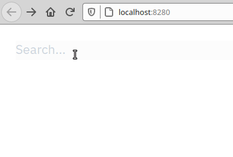

# kamili

**This is currently under construction.**

Kamili is supposed to become a Clojure(script) fullstack template. Currently it
is more of an exploration project.

The app is a Single Page Application with frontend as well as backend routes.
It simply defines a little search interface for some well known CS people.



These views should probably adapted to your own needs, but give you a nice
starting point.

## Usage

Install the npm modules
```
yarn install
```

Run clojure as
```
clj -A:dev -r
```

then simply run
```clj
(user/go)
```
If you want to connect to a cljs repl you can run the following
afterwards
```clj
(shadow/repl :app)
```

The app is then available at [http://localhost:8280](http://localhost:8280).

### Emacs
If you are using cider, you can simply do `clj-jack-in-clj&cljs` which automatically
runs the above commands.

## What's in the box?

### Integrant

[Integrant](https://github.com/weavejester/integrant) is a small framework
that lets you intialize your system from an [edn file](resources/kamili/system.edn).
The setup closely resembles the steps described by this
[lambdaisland](https://lambdaisland.com/blog/2019-12-11-advent-of-parens-11-integrant-in-practice)
post.

### Server side

The current setup uses a combination of [pedestal](https://github.com/pedestal/pedestal)
and [reitit](https://github.com/metosin/reitit). Mainly to have interceptors from pedestal
and reitit for routing as well as [malli](https://github.com/metosin/malli) for parameter
coercing.

This setup is not set in stone and might still change a bit.

### Frontend

The frontend uses vanilla [re-frame](https://github.com/day8/re-frame) together
with [reitit-frontend](https://github.com/metosin/reitit).
[shadow-cljs](https://github.com/thheller/shadow-cljs) is used for hot-reloading
the cljs files.

### Logging

We use [glogi](https://github.com/lambdaisland/glogi) in the frontend and
[pedestal.log](https://github.com/pedestal/pedestal/tree/master/log) in the backend.
These are unified in a common [logging namespace](src/io/kamili/logging.cljc) so you don't
have to remember the details.

### Tests

### Dev

The extra dev dependencies include a version of
[tools.deps.alpha](https://github.com/clojure/tools.deps.alpha) that includes
`add-lib` as well as [scope-capture](https://github.com/vvvvalvalval/scope-capture).
Scope-capture is especially helpful when you are setting up your backend
handling and want to inspect the context at some point.

## License

Copyright © 2020 Finn Völkel

MIT License
